# Sue Events Fullstack Architecture Document

*Generado por Architect - Winston 🏗️*

---

## Introduction

Este documento define la arquitectura completa full-stack para Sue Events, incluyendo sistemas backend, implementación frontend, y su integración. Sirve como la única fuente de verdad para desarrollo dirigido por IA, asegurando consistencia a través de todo el stack tecnológico.

Este enfoque unificado combina lo que tradicionalmente serían documentos separados de arquitectura backend y frontend, optimizando el proceso de desarrollo para aplicaciones fullstack modernas donde estas preocupaciones están cada vez más interconectadas.

### Starter Template o Proyecto Existente

**Análisis del Proyecto Base:**

Basado en mi investigación del codebase, Sue Events NO utiliza ningún starter template - es un desarrollo personalizado desde cero. La arquitectura actual incluye:

- **Estructura monolítica** con separación clara de responsabilidades
- **Supabase** como backend completo (BD + Auth + Storage)
- **React SPA** con Vite como bundler
- **Material-UI** como sistema de diseño

**Decisión:** Este es un proyecto brownfield maduro sin dependencia de starters. La arquitectura se documentará basada en el estado actual funcional.

### Change Log
| Fecha | Versión | Descripción | Autor |
|-------|---------|-------------|-------|
| 2025-01-09 | 1.0 | Arquitectura inicial full-stack | Winston (Architect) |

---

## High Level Architecture

### Technical Summary

Sue Events implementa una **arquitectura SPA (Single Page Application) con Backend-as-a-Service**, optimizada para desarrollo rápido y mantenimiento simplificado. La aplicación React TypeScript se comunica directamente con Supabase mediante cliente JavaScript, eliminando la necesidad de una capa de API custom. El sistema utiliza **Row Level Security (RLS)** para autorización a nivel de base de datos y **Real-time subscriptions** para actualizaciones en vivo de cotizaciones. La generación de PDFs se maneja client-side usando html2canvas + jsPDF, manteniendo toda la lógica de negocio en el frontend. Este enfoque arquitectónico permite iteración rápida y deployment simplificado, siendo ideal para equipos pequeños que requieren alta productividad sin sacrificar funcionalidad enterprise.

### Platform and Infrastructure Choice

**Platform:** Vercel + Supabase
**Key Services:** 
- Supabase: PostgreSQL, Auth, Storage, Real-time
- Vercel: Frontend hosting, Edge functions, Analytics
**Deployment Host and Regions:** Global CDN via Vercel, DB en us-east-1

### Repository Structure

**Structure:** Single Repository con organización modular
**Monorepo Tool:** N/A - Estructura simple suficiente
**Package Organization:** Organización por features/módulos dentro de src/

### High Level Architecture Diagram

```mermaid
graph TB
    User[👤 Usuarios Web] --> CDN[🌐 Vercel CDN]
    CDN --> SPA[⚛️ React SPA<br/>Sue Events]
    
    SPA --> SupaAuth[🔐 Supabase Auth<br/>JWT + RLS]
    SPA --> SupaDB[(🗄️ PostgreSQL<br/>Supabase)]
    SPA --> SupaStorage[📁 Supabase Storage<br/>PDFs & Assets]
    SPA --> SupaRealtime[⚡ Realtime<br/>Live Updates]
    
    SPA --> PDF[📄 PDF Generator<br/>Client-side]
    PDF --> LocalDownload[💾 Local Download]
    
    SupaDB --> RLS[🛡️ Row Level Security]
    SupaAuth --> RLS
    
    Admin[👨‍💼 Admin Users] --> SPA
    Sales[👩‍💼 Sales Team] --> SPA
```



### Architectural Patterns

- **Jamstack Architecture:** React SPA + Serverless functions + CDN deployment - _Rationale:_ Máximo performance y escalabilidad para aplicaciones business con contenido dinámico
- **Client-Side State Management:** React Query + Local State con hooks - _Rationale:_ Cache inteligente y sincronización automática con backend, reduciendo complejidad
- **Database-First Authorization:** Row Level Security en PostgreSQL - _Rationale:_ Seguridad a nivel de datos independiente del frontend, prevent data leakage
- **Component-Based UI:** Atomic design con Material-UI - _Rationale:_ Reutilización máxima y consistencia visual enterprise sin desarrollo custom
- **Real-time Data Sync:** Supabase subscriptions para updates en vivo - _Rationale:_ UX moderna para colaboración en cotizaciones y cambios de estado
- **Client-Side PDF Generation:** html2canvas + jsPDF - _Rationale:_ No requiere servidor adicional, control total sobre styling, funciona offline

---

## Tech Stack

### Technology Stack Table

| Category | Technology | Version | Purpose | Rationale |
|----------|------------|---------|---------|-----------|
| Frontend Language | TypeScript | 5.3.0 | Lenguaje principal frontend | Type safety, mejor DX, integración perfecta con ecosistema React |
| Frontend Framework | React | 18.2.0 | Framework UI principal | Ecosistema maduro, hooks modernos, concurrent features para UX fluida |
| UI Component Library | Material-UI (MUI) | 5.15.0 | Sistema de diseño | Componentes enterprise-ready, theming avanzado, 70% menos tiempo de desarrollo UI |
| State Management | TanStack Query + React Hooks | 5.17.0 + Built-in | Cache y state management | Server state inteligente, cache automático, optimistic updates, elimina boilerplate |
| Backend Language | PostgreSQL + JavaScript | 15+ / ES2022 | Base de datos y lógica | Supabase maneja backend, funciones edge en JS cuando necesario |
| Backend Framework | Supabase (BaaS) | 2.56.1 | Backend completo | Auth, DB, Storage, Realtime todo integrado, 0 config de servidor |
| API Style | REST + Real-time | HTTP/1.1 + WebSockets | Comunicación frontend-backend | REST para operaciones CRUD, WebSockets para live updates de cotizaciones |
| Database | PostgreSQL | 15+ | Almacenamiento principal | ACID compliance, JSON support, full-text search, RLS nativo |
| Cache | Browser + React Query | Built-in | Cache de aplicación | Cache L1 en browser, L2 en React Query, TTL inteligente |
| File Storage | Supabase Storage | Built-in | PDFs y assets | Storage S3-compatible, CDN automático, integración nativa con RLS |
| Authentication | Supabase Auth | Built-in | Autenticación y autorización | JWT + RLS, social login, MFA ready, session management automático |
| Frontend Testing | Jest + Testing Library | 29.7.0 + 13.4.0 | Unit y integration tests | Testing estándar React, queries realistas, snapshot testing |
| Backend Testing | Supabase Local + pgTAP | Built-in | Database testing | Testing de migraciones y RLS policies, environment reproducible |
| E2E Testing | Playwright | 24.18.0 | End-to-end testing | Cross-browser testing, reliable selectors, screenshot comparison |
| Build Tool | Vite | 5.0.0 | Bundler y dev server | HMR ultra-rápido, tree shaking, optimizado para React + TS |
| Bundler | Vite (internal) | 5.0.0 | Empaquetado para producción | Bundle splitting automático, asset optimization, code splitting |
| IaC Tool | N/A | - | Infraestructura | Supabase + Vercel manejan infra, no requiere IaC |
| CI/CD | Vercel + GitHub Actions | Built-in + Latest | Deploy y testing | Auto-deploy desde git, preview deployments, testing pipeline |
| Monitoring | Supabase Dashboard + Vercel Analytics | Built-in | Performance y errors | Real-time metrics, error tracking, performance insights |
| Logging | Supabase Logs + Console | Built-in | Application logging | Structured logs, real-time viewing, filtros avanzados |
| CSS Framework | Material-UI + Emotion | 5.15.0 + 11.11.0 | Styling system | CSS-in-JS, theming dinámico, responsive built-in, 0 CSS custom |

---

## Data Models

### Employee

**Purpose:** Representa empleados especializados (chefs, operarios, meseros, supervisores) con categorías, tarifas horarias flexibles y cálculo automático de ARL.

**Key Attributes:**
- id: number - Identificador único del empleado
- name: string - Nombre completo del empleado
- employee_type: EmployeeType - Tipo base (operario, chef, mesero, supervisor, conductor)
- category_id: number - Referencia a categoría que define tarifas y configuraciones
- hourly_rates: HourlyRateRange[] - Tarifas por rangos de horas (1-4h, 4-8h, 8h+)
- has_arl: boolean - Si tiene ARL (Administradora de Riesgos Laborales)
- is_active: boolean - Si está disponible para asignación

#### TypeScript Interface
```typescript
export interface Employee {
  id: number;
  name: string;
  employee_type: EmployeeType;
  category_id?: number;
  category?: EmployeeCategory;
  phone?: string;
  email?: string;
  hourly_rates?: HourlyRateRange[];
  has_arl: boolean;
  arl_provider?: string;
  certifications?: string[];
  is_active: boolean;
  created_at: string;
  updated_at: string;
}
```

#### Relationships
- Belongs to EmployeeCategory (many-to-one)
- Has many QuoteEmployees (one-to-many)
- Has many EmployeeScheduleSlots (one-to-many)

### Quote

**Purpose:** Cotización completa que combina empleados, productos, transporte y costos adicionales con cálculo automático de totales.

**Key Attributes:**
- id: number - Identificador único de la cotización
- client_id: number - Cliente asociado
- event_date: Date - Fecha del evento
- event_duration_hours: number - Duración en horas
- status: QuoteStatus - Estado (pendiente, aceptado, cancelado)
- total_amount: number - Monto total calculado automáticamente
- profit_margin_percentage: number - Margen de ganancia aplicado

#### TypeScript Interface
```typescript
export interface Quote {
  id: number;
  client_id: number;
  client?: Client;
  event_date: string;
  event_start_time: string;
  event_duration_hours: number;
  event_location?: string;
  status: QuoteStatus;
  employees: QuoteEmployee[];
  products: QuoteProduct[];
  transport?: QuoteTransport;
  additional_costs: QuoteAdditionalCost[];
  subtotal_employees: number;
  subtotal_products: number;
  subtotal_transport: number;
  subtotal_additional: number;
  profit_margin_percentage: number;
  total_amount: number;
  notes?: string;
  created_at: string;
  updated_at: string;
}
```

#### Relationships
- Belongs to Client (many-to-one)
- Has many QuoteEmployees (one-to-many)
- Has many QuoteProducts (one-to-many)
- Has one QuoteTransport (one-to-one)
- Has many QuoteAdditionalCosts (one-to-many)

[Additional data models: Product, Client, TransportZone with similar structure]

---

## API Specification

### REST API Specification

```yaml
openapi: 3.0.0
info:
  title: Sue Events API
  version: 1.0.0
  description: API REST para sistema de cotizaciones y gestión de eventos
servers:
  - url: https://ieefwiphdesfedbpjupp.supabase.co/rest/v1
    description: Supabase REST API Endpoint

components:
  securitySchemes:
    BearerAuth:
      type: http
      scheme: bearer
      bearerFormat: JWT

security:
  - BearerAuth: []

paths:
  /quotes:
    get:
      summary: Listar cotizaciones
      parameters:
        - name: status
          in: query
          schema:
            type: string
        - name: client_id
          in: query
          schema:
            type: integer
      responses:
        '200':
          description: Lista de cotizaciones
    
    post:
      summary: Crear nueva cotización
      responses:
        '201':
          description: Cotización creada exitosamente

  /quotes/{id}/pdf:
    get:
      summary: Generar PDF de cotización
      parameters:
        - name: id
          in: path
          required: true
          schema:
            type: integer
      responses:
        '200':
          description: PDF generado
          content:
            application/pdf:
              schema:
                type: string
                format: binary

  /pricing/calculate:
    post:
      summary: Calcular pricing para cotización
      description: Calcula totales incluyendo empleados, productos, transporte y ARL
      responses:
        '200':
          description: Cálculo de pricing completo
```

---

## Components

### QuoteCalculatorService

**Responsibility:** Servicio central que maneja todo el cálculo complejo de cotizaciones, incluyendo tarifas horarias por rangos, cálculos de ARL, costos de transporte por zonas, y aplicación de márgenes de ganancia.

**Key Interfaces:**
- `calculateEmployeeCosts(employees: EmployeePricingInput[]): EmployeePricingResult[]`
- `calculateProductCosts(products: ProductPricingInput[]): ProductPricingResult[]`
- `calculateTransportCosts(zone: TransportPricingInput): TransportPricingResult`
- `calculateQuoteTotal(quote: QuoteCalculationInput): QuoteTotal`

**Dependencies:** EmployeeService, ProductService, TransportService

**Technology Stack:** TypeScript service classes, React Query para caching, Supabase client para data fetching

### PDFGeneratorService

**Responsibility:** Genera PDFs profesionales de cotizaciones usando plantillas personalizables, convirtiendo componentes React a canvas y luego a PDF con branding consistente.

**Key Interfaces:**
- `generateQuotePDF(quote: Quote, template?: QuoteTemplate): Promise<Blob>`
- `downloadPDF(quote: Quote, filename: string): Promise<void>`
- `previewPDF(quote: Quote): Promise<string>` (base64 preview)

**Dependencies:** QuoteTemplateService, html2canvas, jsPDF

**Technology Stack:** html2canvas + jsPDF, React components para templates, Supabase Storage para almacenamiento opcional

[Additional components: QuoteManagementComponent, EmployeeSchedulingComponent, DataSyncManager, AuthenticationGuard, ReportingEngine]

### Component Diagrams

```mermaid
graph TB
    UI[🎨 React Components<br/>Material-UI] --> QMC[📋 QuoteManagementComponent]
    UI --> ESC[📅 EmployeeSchedulingComponent]
    UI --> AUTH[🔐 AuthenticationGuard]
    
    QMC --> QCS[🧮 QuoteCalculatorService]
    QMC --> PDFS[📄 PDFGeneratorService]
    QMC --> DSM[🔄 DataSyncManager]
    
    ESC --> ES[👥 EmployeeService]
    ESC --> DSM
    
    QCS --> ES
    QCS --> PS[🛍️ ProductService]
    QCS --> TS[🚚 TransportService]
    
    DSM --> SUPABASE[(🗄️ Supabase<br/>DB + Realtime)]
    ES --> SUPABASE
    PS --> SUPABASE
    TS --> SUPABASE
    
    AUTH --> SUPABASE
    
    RE[📊 ReportingEngine] --> SUPABASE
    PDFS --> QTS[📝 QuoteTemplateService]
    QTS --> SUPABASE
```



---

## External APIs

Sue Events actualmente **no requiere integraciones con APIs externas** para su funcionamiento core.

**Estado actual:** El sistema es completamente self-contained, utilizando únicamente:
- **Supabase API** (que es la "API externa" principal del sistema)
- **Generación de PDFs client-side** (sin dependencia de servicios externos)
- **No integración con sistemas de pago** (las cotizaciones se procesan offline)
- **No integración con servicios de email** (comunicación manual con clientes)

### Futuras Integraciones Potenciales

**Estrategia de integración futura:**
- **Fase 1:** WhatsApp Business API (mayor ROI)
- **Fase 2:** Google Maps para optimización de transporte
- **Fase 3:** DIAN API cuando se requiera facturación electrónica
- **Fase 4:** Email automation para clientes corporativos

---

## Core Workflows

### Quote Creation Workflow

```mermaid
sequenceDiagram
    participant User as 👤 Sales User
    participant UI as 🎨 QuoteManagement
    participant QCS as 🧮 QuoteCalculator
    participant ES as 👥 EmployeeService
    participant PS as 🛍️ ProductService
    participant TS as 🚚 TransportService
    participant DB as 🗄️ Supabase
    participant PDF as 📄 PDFGenerator

    User->>UI: Iniciar nueva cotización
    UI->>DB: Cargar clientes activos
    UI->>ES: Cargar empleados disponibles
    UI->>PS: Cargar productos activos
    UI->>TS: Cargar zonas de transporte
    
    User->>UI: Seleccionar cliente y fecha
    User->>UI: Agregar empleados (tipo, horas)
    UI->>QCS: Calcular costos empleados
    QCS->>ES: Obtener tarifas por categoría
    QCS->>QCS: Aplicar rangos horarios (1-4h, 4-8h, 8h+)
    QCS->>QCS: Calcular ARL automáticamente
    QCS-->>UI: Retornar costos empleados
    
    User->>UI: Agregar productos (cantidad, tipo)
    UI->>QCS: Calcular costos productos  
    QCS->>PS: Obtener precios por producto
    QCS->>QCS: Aplicar lógica pricing (fijo/variable/medida)
    QCS-->>UI: Retornar costos productos
    
    User->>UI: Seleccionar zona transporte
    UI->>QCS: Calcular costos transporte
    QCS->>TS: Obtener tarifas por zona
    QCS->>QCS: Aplicar costo base + equipo
    QCS-->>UI: Retornar costos transporte
    
    UI->>QCS: Calcular total final
    QCS->>QCS: Sumar subtotales + aplicar margen
    QCS-->>UI: Total calculado
    
    User->>UI: Confirmar y guardar
    UI->>DB: INSERT cotización + items
    DB-->>UI: Cotización creada (ID)
    
    User->>UI: Generar PDF
    UI->>PDF: Generar documento
    PDF->>DB: Obtener plantilla personalizada
    PDF->>PDF: Renderizar HTML + convertir PDF
    PDF-->>UI: Archivo PDF generado
    PDF->>User: Download automático
```



[Additional workflows: Employee Availability Check, Real-time Collaboration, PDF Generation]

---

## Database Schema

### Core Tables Schema

```sql
-- Users and Authentication (handled by Supabase Auth)
CREATE TABLE public.user_profiles (
    id UUID REFERENCES auth.users(id) PRIMARY KEY,
    full_name TEXT,
    role TEXT CHECK (role IN ('admin', 'sales', 'viewer')) DEFAULT 'sales',
    is_active BOOLEAN DEFAULT true,
    created_at TIMESTAMP WITH TIME ZONE DEFAULT NOW(),
    updated_at TIMESTAMP WITH TIME ZONE DEFAULT NOW()
);

-- Employee Categories with flexible pricing
CREATE TABLE public.employee_categories (
    id SERIAL PRIMARY KEY,
    name TEXT NOT NULL,
    category_type TEXT CHECK (category_type IN ('operario', 'chef', 'mesero', 'supervisor', 'conductor')) NOT NULL,
    description TEXT,
    icon TEXT DEFAULT '👤',
    color TEXT DEFAULT '#1976d2',
    
    -- Pricing configuration
    pricing_type TEXT CHECK (pricing_type IN ('plana', 'flexible')) DEFAULT 'flexible',
    flat_rate DECIMAL(10,2),
    default_hourly_rates JSONB DEFAULT '[]'::jsonb,
    
    default_has_arl BOOLEAN DEFAULT true,
    default_arl_provider TEXT,
    
    is_active BOOLEAN DEFAULT true,
    created_at TIMESTAMP WITH TIME ZONE DEFAULT NOW(),
    updated_at TIMESTAMP WITH TIME ZONE DEFAULT NOW()
);

-- Employees
CREATE TABLE public.employees (
    id SERIAL PRIMARY KEY,
    name TEXT NOT NULL,
    employee_type TEXT CHECK (employee_type IN ('operario', 'chef', 'mesero', 'supervisor', 'conductor')) NOT NULL,
    category_id INTEGER REFERENCES employee_categories(id),
    phone TEXT,
    email TEXT,
    identification_number TEXT UNIQUE,
    
    hourly_rates JSONB DEFAULT '[]'::jsonb,
    has_arl BOOLEAN DEFAULT true,
    arl_provider TEXT,
    certifications TEXT[] DEFAULT ARRAY[]::TEXT[],
    
    hire_date DATE,
    birth_date DATE,
    address TEXT,
    emergency_contact JSONB,
    
    is_active BOOLEAN DEFAULT true,
    created_at TIMESTAMP WITH TIME ZONE DEFAULT NOW(),
    updated_at TIMESTAMP WITH TIME ZONE DEFAULT NOW()
);

-- Main Quotes table
CREATE TABLE public.quotes (
    id SERIAL PRIMARY KEY,
    client_id INTEGER REFERENCES clients(id) NOT NULL,
    event_date DATE NOT NULL,
    event_start_time TIME,
    event_duration_hours DECIMAL(4,2) NOT NULL,
    event_location TEXT,
    
    status TEXT CHECK (status IN ('pendiente', 'aceptado', 'cancelado')) DEFAULT 'pendiente',
    
    subtotal_employees DECIMAL(12,2) DEFAULT 0,
    subtotal_products DECIMAL(12,2) DEFAULT 0, 
    subtotal_transport DECIMAL(12,2) DEFAULT 0,
    subtotal_additional DECIMAL(12,2) DEFAULT 0,
    
    profit_margin_percentage DECIMAL(5,2) DEFAULT 25.00,
    total_amount DECIMAL(12,2) NOT NULL DEFAULT 0,
    
    notes TEXT,
    template_id INTEGER REFERENCES quote_templates(id),
    
    created_by UUID REFERENCES auth.users(id),
    created_at TIMESTAMP WITH TIME ZONE DEFAULT NOW(),
    updated_at TIMESTAMP WITH TIME ZONE DEFAULT NOW()
);

-- [Additional tables: clients, products, transport_zones, quote_employees, quote_products, etc.]

-- Row Level Security (RLS) Policies
ALTER TABLE quotes ENABLE ROW LEVEL SECURITY;

CREATE POLICY "Admins can view all quotes" ON quotes FOR SELECT USING (
    EXISTS (SELECT 1 FROM user_profiles WHERE id = auth.uid() AND role = 'admin')
);

CREATE POLICY "Sales can view and create quotes" ON quotes FOR ALL USING (
    EXISTS (SELECT 1 FROM user_profiles WHERE id = auth.uid() AND role IN ('admin', 'sales'))
);
```

---

## Frontend Architecture

### Component Architecture

#### Component Organization
```text
src/
├── components/
│   ├── common/              # Componentes reutilizables base
│   ├── layout/              # Layout y navegación
│   ├── quotes/              # Módulo de cotizaciones
│   ├── employees/           # Módulo de empleados
│   ├── products/            # Módulo de productos
│   ├── clients/             # Módulo de clientes
│   ├── pricing/             # Calculadora de precios
│   └── settings/            # Configuración
├── pages/                   # Page components (route handlers)
├── hooks/                   # Custom React hooks
└── shared/                  # Shared utilities y types
```

#### Component Template
```typescript
import React from 'react';
import { Box, Typography, Paper } from '@mui/material';
import { useQuotes } from '@/hooks/useQuotes';
import type { Quote } from '@/types';

interface QuoteListProps {
  clientId?: number;
  status?: QuoteStatus;
  onQuoteSelect?: (quote: Quote) => void;
}

export const QuoteList: React.FC<QuoteListProps> = ({
  clientId,
  status,
  onQuoteSelect
}) => {
  const { quotes, loading, error } = useQuotes({ clientId, status });

  if (loading) return <LoadingSpinner />;
  if (error) return <ErrorMessage error={error} />;

  return (
    <Paper sx={{ p: 2 }}>
      <Typography variant="h6" gutterBottom>
        Cotizaciones
      </Typography>
      {quotes.map(quote => (
        <QuoteCard
          key={quote.id}
          quote={quote}
          onClick={() => onQuoteSelect?.(quote)}
        />
      ))}
    </Paper>
  );
};
```

### State Management Architecture

#### State Structure
```typescript
interface AppState {
  // Server state (managed by React Query)
  quotes: UseQueryResult<Quote[]>;
  employees: UseQueryResult<Employee[]>;
  products: UseQueryResult<Product[]>;
  clients: UseQueryResult<Client[]>;
  
  // Local UI state (managed by useState/useReducer)
  ui: {
    sidebarOpen: boolean;
    currentTheme: 'light' | 'dark';
    selectedQuote: Quote | null;
    notifications: Notification[];
  };
  
  // Auth state (managed by Supabase Auth)
  auth: {
    user: User | null;
    session: Session | null;
    loading: boolean;
  };
}
```

#### State Management Patterns
- **Server State:** React Query para cache inteligente y sincronización automática
- **Local UI State:** useState/useReducer para estado de componentes
- **Global UI State:** Context API para theme, notifications, navigation state
- **Form State:** React Hook Form para validación y submission
- **Real-time Updates:** Supabase subscriptions integradas con React Query

### Routing Architecture

#### Protected Route Pattern
```typescript
interface ProtectedRouteProps {
  children: React.ReactNode;
  allowedRoles?: UserRole[];
  requireAuth?: boolean;
}

export const ProtectedRoute: React.FC<ProtectedRouteProps> = ({
  children,
  allowedRoles = ['admin', 'sales', 'viewer'],
  requireAuth = true
}) => {
  const { user, loading } = useAuth();
  const location = useLocation();

  if (loading) return <LoadingSpinner />;

  if (requireAuth && !user) {
    return <Navigate to="/login" state={{ from: location }} replace />;
  }

  if (user && allowedRoles && !allowedRoles.includes(user.role)) {
    return <Navigate to="/unauthorized" replace />;
  }

  return <>{children}</>;
};
```

### Frontend Services Layer

#### API Client Setup
```typescript
import { createClient } from '@supabase/supabase-js';
import type { Database } from '@/types/database.types';

const supabaseUrl = import.meta.env.VITE_SUPABASE_URL;
const supabaseAnonKey = import.meta.env.VITE_SUPABASE_ANON_KEY;

export const supabase = createClient<Database>(supabaseUrl, supabaseAnonKey, {
  auth: {
    autoRefreshToken: true,
    persistSession: true,
    detectSessionInUrl: true
  },
  realtime: {
    params: {
      eventsPerSecond: 10
    }
  }
});
```

---

## Backend Architecture

### Service Architecture

#### Serverless Architecture (Supabase + Edge Functions)

##### Function Organization
```text
supabase/
├── functions/
│   ├── pricing-calculator/     # Cálculos complejos de pricing
│   ├── pdf-generator/          # Generación server-side de PDFs
│   ├── notification-sender/    # Envío de notificaciones
│   ├── quote-validator/        # Validación de cotizaciones
│   └── report-generator/       # Generación de reportes
├── migrations/                 # Database migrations
└── config.toml               # Supabase configuration
```

##### Function Template (Edge Function)
```typescript
import { serve } from "https://deno.land/std@0.168.0/http/server.ts"
import { createClient } from 'https://esm.sh/@supabase/supabase-js@2'
import { corsHeaders } from '../_shared/cors.ts'

interface PricingRequest {
  employees: EmployeePricingInput[];
  products: ProductPricingInput[];
  transportZoneId?: number;
  eventDurationHours: number;
}

serve(async (req) => {
  if (req.method === 'OPTIONS') {
    return new Response('ok', { headers: corsHeaders })
  }

  try {
    const supabase = createClient(
      Deno.env.get('SUPABASE_URL') ?? '',
      Deno.env.get('SUPABASE_SERVICE_ROLE_KEY') ?? ''
    )

    const body: PricingRequest = await req.json();
    
    // Calculate costs using business logic
    const employeeCalculator = new EmployeePricingCalculator(supabase);
    const employeeCosts = await employeeCalculator.calculate(body.employees);

    const response = {
      subtotalEmployees: employeeCosts.reduce((sum, emp) => sum + emp.totalCost, 0),
      // ... other calculations
    };

    return new Response(JSON.stringify(response), {
      headers: { ...corsHeaders, 'Content-Type': 'application/json' }
    });

  } catch (error) {
    return new Response(JSON.stringify({ error: error.message }), {
      status: 500,
      headers: { ...corsHeaders, 'Content-Type': 'application/json' }
    });
  }
})
```

### Database Architecture

#### Schema Design (PostgreSQL + Supabase Extensions)
```sql
-- Custom functions for business logic
CREATE OR REPLACE FUNCTION calculate_arl_cost(
  base_cost DECIMAL(10,2),
  has_arl BOOLEAN
) RETURNS DECIMAL(10,2) AS $$
BEGIN
  IF has_arl THEN
    RETURN base_cost * 0.00522; -- 0.522% ARL rate in Colombia
  ELSE
    RETURN 0;
  END IF;
END;
$$ LANGUAGE plpgsql IMMUTABLE;

-- Trigger function to update quote totals
CREATE OR REPLACE FUNCTION update_quote_totals()
RETURNS TRIGGER AS $$
BEGIN
  UPDATE quotes SET 
    subtotal_employees = (
      SELECT COALESCE(SUM(total_cost), 0)
      FROM quote_employees 
      WHERE quote_id = NEW.quote_id
    ),
    total_amount = (
      subtotal_employees + subtotal_products + subtotal_transport + subtotal_additional
    ) * (1 + profit_margin_percentage / 100),
    updated_at = NOW()
  WHERE id = NEW.quote_id;

  RETURN NEW;
END;
$$ LANGUAGE plpgsql;

-- Triggers for automatic total calculation
CREATE TRIGGER trigger_update_quote_totals_employees
  AFTER INSERT OR UPDATE OR DELETE ON quote_employees
  FOR EACH ROW EXECUTE FUNCTION update_quote_totals();
```

### Authentication and Authorization

#### Auth Flow

```mermaid
sequenceDiagram
    participant Client as 🎨 Frontend
    participant Auth as 🔐 Supabase Auth
    participant DB as 🗄️ Database
    participant RLS as 🛡️ Row Level Security

    Client->>Auth: Login (email/password)
    Auth->>Auth: Validate credentials
    Auth-->>Client: JWT token + User data
    
    Client->>DB: API request with JWT
    DB->>RLS: Validate token & extract user
    RLS->>RLS: Check RLS policies
    
    alt User authorized
        RLS-->>DB: Allow query execution
        DB-->>Client: Return filtered data
    else User not authorized
        RLS-->>DB: Block query execution  
        DB-->>Client: Return 403 Forbidden
    end
```


#### Middleware/Guards (RLS Policies)
```sql
-- Advanced RLS policies for business logic
CREATE POLICY "Sales can only view own quotes unless admin" ON quotes
FOR SELECT USING (
  CASE 
    WHEN (SELECT role FROM user_profiles WHERE id = auth.uid()) = 'admin' THEN true
    WHEN (SELECT role FROM user_profiles WHERE id = auth.uid()) = 'sales' THEN created_by = auth.uid()
    ELSE false
  END
);

-- Function to check employee availability
CREATE OR REPLACE FUNCTION check_employee_availability(
  employee_id INTEGER,
  event_date DATE,
  start_time TIME,
  duration_hours DECIMAL
) RETURNS BOOLEAN AS $$
DECLARE
  end_time TIME := start_time + (duration_hours || ' hours')::INTERVAL;
  conflict_count INTEGER;
BEGIN
  SELECT COUNT(*) INTO conflict_count
  FROM employee_schedule_slots
  WHERE employee_id = check_employee_availability.employee_id
    AND event_date = check_employee_availability.event_date
    AND status IN ('scheduled', 'confirmed')
    AND (
      (start_time <= check_employee_availability.start_time AND end_time > check_employee_availability.start_time)
      OR (start_time < end_time AND end_time >= end_time)
      OR (start_time >= check_employee_availability.start_time AND end_time <= end_time)
    );
    
  RETURN conflict_count = 0;
END;
$$ LANGUAGE plpgsql SECURITY DEFINER;
```

---

## Unified Project Structure

```plaintext
sue-events/
├── .github/                         # CI/CD workflows
│   └── workflows/
│       ├── ci.yaml                  # Testing y linting
│       ├── deploy.yaml              # Deploy a Vercel
│       └── supabase-deploy.yaml     # Deploy edge functions
├── public/                          # Assets estáticos
│   ├── favicon.ico
│   ├── vite.svg
│   └── assets/
├── src/                            # Frontend application
│   ├── components/                 # Componentes React organizados por feature
│   │   ├── common/                 # Componentes reutilizables
│   │   ├── layout/                # Layout y navegación
│   │   ├── quotes/                # Módulo cotizaciones (CORE)
│   │   ├── employees/             # Gestión empleados
│   │   ├── products/              # Catálogo productos
│   │   ├── clients/               # Base clientes
│   │   ├── pricing/               # Calculadora precios
│   │   ├── scheduling/            # Programación eventos
│   │   ├── transport/             # Zonas transporte
│   │   ├── categories/            # Categorías empleados/productos
│   │   └── settings/              # Configuración sistema
│   ├── pages/                     # Page components (rutas)
│   ├── hooks/                     # Custom React hooks
│   ├── services/                  # Business logic services
│   ├── shared/                    # Código compartido
│   │   ├── constants/             # Constantes aplicación
│   │   ├── utils/                 # Utilidades generales
│   │   └── config/                # Configuración
│   ├── types/                     # TypeScript definitions
│   ├── assets/                    # Assets del frontend
│   ├── App.tsx                    # Componente raíz
│   ├── main.tsx                   # Entry point
│   └── vite-env.d.ts             # Vite types
├── supabase/                      # Backend (Supabase)
│   ├── functions/                 # Edge Functions (Serverless)
│   ├── migrations/                # Database migrations (CRITICAL)
│   ├── seed.sql                   # Data inicial
│   ├── config.toml               # Configuración Supabase
│   └── .env.local                # Variables locales
├── tests/                         # Testing suite
│   ├── unit/                     # Unit tests
│   ├── integration/              # Integration tests
│   ├── e2e/                      # Playwright E2E tests
│   └── setup/                    # Test setup files
├── scripts/                       # Build/deploy scripts
├── docs/                         # Documentación proyecto
│   ├── brief.md                  # Project brief
│   ├── architecture.md           # Este documento
│   └── development/              # Guías desarrollo
├── .env.example                   # Template variables entorno
├── package.json                   # Dependencies
├── tsconfig.json                 # TypeScript config
├── vite.config.ts                # Vite configuration
└── README.md                     # Project documentation
```

---

## Development Workflow

### Local Development Setup

#### Prerequisites
```bash
# Node.js y package manager
node --version  # >= 18.0.0
npm --version   # >= 8.0.0

# Supabase CLI
npm install -g @supabase/cli
supabase --version  # >= 1.100.0
```

#### Initial Setup
```bash
# Clonar el repositorio
git clone <repo-url> sue-events
cd sue-events

# Instalar dependencias
npm install

# Setup Supabase local development
supabase login
supabase init
supabase start  # Inicia PostgreSQL local + Dashboard

# Aplicar migraciones existentes
supabase db reset  # Aplica todas las migraciones

# Generar tipos TypeScript desde schema
npm run generate-types

# Crear archivo de environment variables
cp .env.example .env.local
# Editar .env.local con keys de Supabase local

# Verificar que todo funciona
npm run dev
```

#### Development Commands
```bash
# Start all services
npm run dev              # Vite dev server en puerto 3000
supabase start          # Backend local (separado)

# Database operations
supabase db reset       # Reset DB + aplicar migraciones
supabase db push        # Push cambios locales a remote
npm run generate-types  # Regenerar tipos desde DB

# Testing commands
npm run test:unit          # Jest unit tests
npm run test:integration   # Integration tests con DB local
npm run test:e2e          # Playwright end-to-end
npm run test:coverage     # Coverage report

# Code quality
npm run lint              # ESLint checking
npm run type-check        # TypeScript validation
npm run duplicate-check   # jscpd duplicate detection

# Build and preview
npm run build            # Production build
npm run preview         # Preview production build
```

### Environment Configuration

#### Frontend (.env.local)
```bash
# Supabase Configuration
VITE_SUPABASE_URL=http://localhost:54321  # Local: 54321, Cloud: tu-url
VITE_SUPABASE_ANON_KEY=tu-anon-key

# Application Settings
VITE_APP_NAME="Sue Events - Sistema de Cotizaciones"
VITE_APP_VERSION="1.0.0"
VITE_APP_ENVIRONMENT="development"
```

#### Backend (supabase/.env)
```bash
# Supabase Service Keys
SUPABASE_URL=https://tu-proyecto.supabase.co
SUPABASE_SERVICE_ROLE_KEY=tu-service-key
SUPABASE_ANON_KEY=tu-anon-key

# Database
DATABASE_URL=postgresql://postgres:password@db:5432/postgres

# Environment
ENVIRONMENT=development
```

---

## Deployment Architecture

### Deployment Strategy

**Frontend Deployment:**
- **Platform:** Vercel (current optimal choice)
- **Build Command:** `npm run build`
- **Output Directory:** `dist`
- **CDN/Edge:** Vercel Edge Network global distribution

**Backend Deployment:**
- **Platform:** Supabase (managed PostgreSQL + Edge Functions)
- **Build Command:** `supabase functions deploy`
- **Deployment Method:** Git-based deployment with automatic builds

### CI/CD Pipeline

```yaml
# .github/workflows/deploy.yaml
name: Deploy to Production

on:
  push:
    branches: [main]
  pull_request:
    branches: [main]

jobs:
  test:
    runs-on: ubuntu-latest
    steps:
      - uses: actions/checkout@v3
      - uses: actions/setup-node@v3
        with:
          node-version: '18'
          cache: 'npm'
      
      - name: Install dependencies
        run: npm ci
      
      - name: Run linting
        run: npm run lint
      
      - name: Run type checking
        run: npm run type-check
      
      - name: Run unit tests
        run: npm run test:unit
      
      - name: Build application
        run: npm run build

  deploy-frontend:
    needs: test
    runs-on: ubuntu-latest
    if: github.ref == 'refs/heads/main'
    steps:
      - uses: actions/checkout@v3
      - name: Deploy to Vercel
        uses: vercel/action@v1
        with:
          vercel-token: ${{ secrets.VERCEL_TOKEN }}
```

### Environments

| Environment | Frontend URL | Backend URL | Purpose |
|------------|-------------|-------------|----------|
| Development | http://localhost:3000 | http://localhost:54321 | Local development |
| Staging | https://sue-events-staging.vercel.app | https://staging-project.supabase.co | Pre-production testing |
| Production | https://sue-events.vercel.app | https://ieefwiphdesfedbpjupp.supabase.co | Live environment |

---

## Security and Performance

### Security Requirements

**Frontend Security:**
- CSP Headers: `default-src 'self'; script-src 'self' 'unsafe-inline'; style-src 'self' 'unsafe-inline' fonts.googleapis.com`
- XSS Prevention: React built-in protection + input sanitization
- Secure Storage: JWT tokens in httpOnly cookies when possible, localStorage as fallback

**Backend Security:**
- Input Validation: Supabase RLS policies + client-side validation
- Rate Limiting: Supabase built-in rate limiting (100 requests/minute per IP)
- CORS Policy: `{ "origin": ["https://sue-events.vercel.app"], "methods": ["GET", "POST", "PUT", "DELETE"] }`

**Authentication Security:**
- Token Storage: Supabase handles JWT refresh automatically
- Session Management: 1 hour access tokens with automatic refresh
- Password Policy: Minimum 8 characters, enforced by Supabase Auth

### Performance Optimization

**Frontend Performance:**
- Bundle Size Target: < 500KB initial load, < 1MB total
- Loading Strategy: Route-based code splitting with React.lazy()
- Caching Strategy: React Query 5min stale time, 30min garbage collection time

**Backend Performance:**
- Response Time Target: < 200ms for CRUD operations, < 2s for complex calculations
- Database Optimization: Indexed queries on employee_type, quote status, event_date
- Caching Strategy: Supabase built-in query caching + CDN for static assets

---

## Testing Strategy

### Testing Pyramid
```text
     E2E Tests (5%)
    /              \
   Integration Tests (25%)
  /                    \
Frontend Unit (35%)  Backend Unit (35%)
```

### Test Organization

#### Frontend Tests
```text
tests/
├── unit/
│   ├── components/
│   ├── hooks/
│   └── services/
├── integration/
│   ├── quote-creation-flow.test.ts
│   ├── employee-scheduling.test.ts
│   └── pdf-generation.test.ts
└── e2e/
    ├── complete-quote-workflow.spec.ts
    └── multi-user-collaboration.spec.ts
```

### Test Examples

#### Frontend Component Test
```typescript
import { render, screen, fireEvent, waitFor } from '@testing-library/react';
import { QueryClient, QueryClientProvider } from '@tanstack/react-query';
import { QuoteForm } from '@/components/quotes/QuoteForm';

describe('QuoteForm', () => {
  it('calculates total correctly when adding employees', async () => {
    render(<QuoteForm onSave={jest.fn()} />, { wrapper: createWrapper() });
    
    fireEvent.change(screen.getByLabelText(/cliente/i), { 
      target: { value: '1' } 
    });
    
    fireEvent.click(screen.getByText(/agregar empleado/i));
    
    await waitFor(() => {
      expect(screen.getByTestId('total-amount')).toHaveTextContent('$240,000');
    });
  });
});
```

#### E2E Test
```typescript
import { test, expect } from '@playwright/test';

test('complete quote creation and PDF generation', async ({ page }) => {
  await page.goto('/quotes/new');
  
  // Fill quote form
  await page.selectOption('[data-testid="client-select"]', '1');
  await page.fill('[data-testid="event-date"]', '2024-02-15');
  await page.fill('[data-testid="event-hours"]', '8');
  
  // Add employee
  await page.click('[data-testid="add-employee"]');
  await page.selectOption('[data-testid="employee-select"]', '1');
  
  // Verify total calculation
  await expect(page.locator('[data-testid="total-amount"]')).toContainText('$240,000');
  
  // Generate PDF
  await page.click('[data-testid="generate-pdf"]');
  
  const download = await page.waitForEvent('download');
  expect(download.suggestedFilename()).toMatch(/cotizacion-\d+\.pdf/);
});
```

---

## Coding Standards

### Critical Fullstack Rules

- **Type Sharing:** Always define types in src/types/ and import consistently across components and services
- **API Calls:** Never make direct Supabase calls in components - always use service layer methods
- **Environment Variables:** Access only through centralized config objects in src/shared/config/, never process.env directly
- **Error Handling:** All service methods must return Promise results with consistent error format
- **State Updates:** Never mutate React Query cache directly - use proper invalidation and refetch patterns
- **Database Queries:** Always use RLS-enabled queries through Supabase client, never bypass security policies
- **PDF Generation:** Use centralized PDFGeneratorService, never inline html2canvas/jsPDF code in components
- **Real-time Updates:** Subscribe to database changes through useRealtime hook, not direct Supabase subscriptions

### Naming Conventions

| Element | Frontend | Backend | Example |
|---------|----------|---------|---------|
| Components | PascalCase | - | `QuoteForm.tsx` |
| Hooks | camelCase with 'use' | - | `useQuotes.ts` |
| Services | camelCase with '.service' | - | `quotes.service.ts` |
| API Routes | - | kebab-case | `/api/quote-calculator` |
| Database Tables | - | snake_case | `quote_employees` |
| Database Functions | - | snake_case | `calculate_arl_cost()` |

---

## Error Handling Strategy

### Error Flow

```mermaid
sequenceDiagram
    participant UI as 🎨 Frontend
    participant Service as 🔧 Service Layer
    participant Supabase as 🗄️ Supabase
    participant User as 👤 User

    UI->>Service: API call
    Service->>Supabase: Database query
    
    alt Success
        Supabase-->>Service: Data response
        Service-->>UI: Formatted data
        UI->>User: Display success
    else Database Error
        Supabase-->>Service: Error response
        Service->>Service: Log error + format
        Service-->>UI: StandardError format
        UI->>User: User-friendly message
    else Network Error
        Service-->>UI: NetworkError format
        UI->>User: Retry option
    end
```


### Error Response Format
```typescript
interface ApiError {
  error: {
    code: string;
    message: string;
    details?: Record<string, any>;
    timestamp: string;
    requestId: string;
  };
}
```

### Frontend Error Handling
```typescript
export class ErrorHandlerService {
  static handleServiceError(error: unknown): StandardError {
    if (error instanceof Error) {
      return {
        code: 'SERVICE_ERROR',
        message: this.getUserFriendlyMessage(error.message),
        details: { originalError: error.message },
        timestamp: new Date().toISOString(),
        requestId: crypto.randomUUID()
      };
    }
    
    return {
      code: 'UNKNOWN_ERROR',
      message: 'Ha ocurrido un error inesperado',
      timestamp: new Date().toISOString(),
      requestId: crypto.randomUUID()
    };
  }
  
  private static getUserFriendlyMessage(technicalMessage: string): string {
    const errorMap = {
      'duplicate key value': 'Ya existe un registro con estos datos',
      'foreign key violation': 'No se puede eliminar, tiene datos relacionados',
      'check constraint': 'Los datos ingresados no son válidos',
      'not null violation': 'Faltan campos obligatorios'
    };
    
    for (const [tech, friendly] of Object.entries(errorMap)) {
      if (technicalMessage.toLowerCase().includes(tech)) {
        return friendly;
      }
    }
    
    return 'Error en la operación solicitada';
  }
}
```

---

## Monitoring and Observability

### Monitoring Stack
- **Frontend Monitoring:** Vercel Analytics + Web Vitals tracking
- **Backend Monitoring:** Supabase Dashboard + PostgreSQL performance insights
- **Error Tracking:** Console logging + Supabase realtime error events
- **Performance Monitoring:** React Query DevTools + Supabase slow query logs

### Key Metrics

**Frontend Metrics:**
- Core Web Vitals (LCP < 2.5s, FID < 100ms, CLS < 0.1)
- JavaScript errors per session
- API response times from client perspective  
- User interactions (quote creation, PDF generation)

**Backend Metrics:**
- Request rate (queries per minute)
- Error rate (< 1% target)
- Response time (95th percentile < 500ms)
- Database query performance (slow query threshold: > 1s)

---

*Arquitectura Full-Stack completada por Winston 🏗️ - Sue Events System*